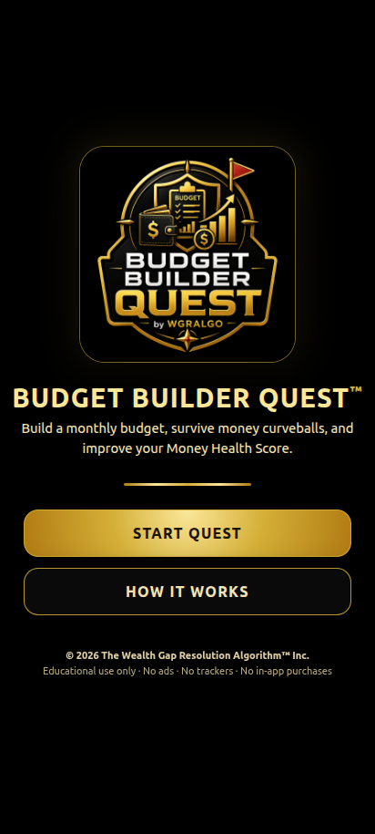
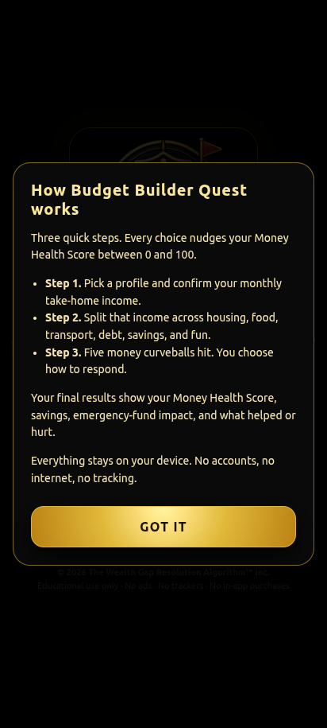
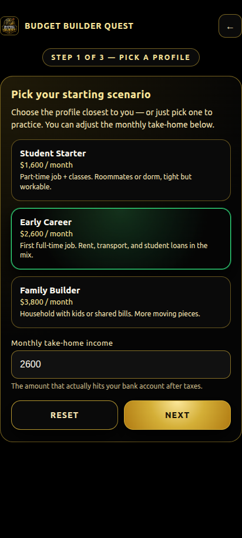
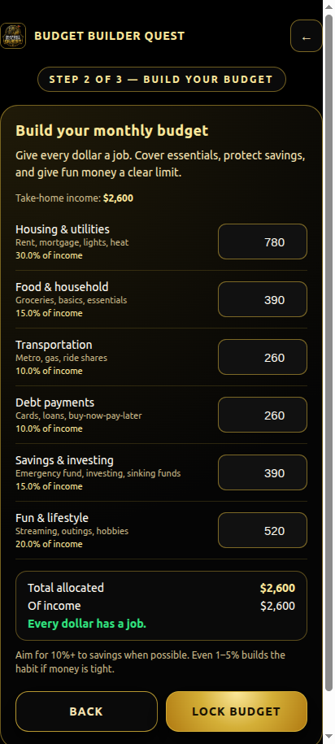
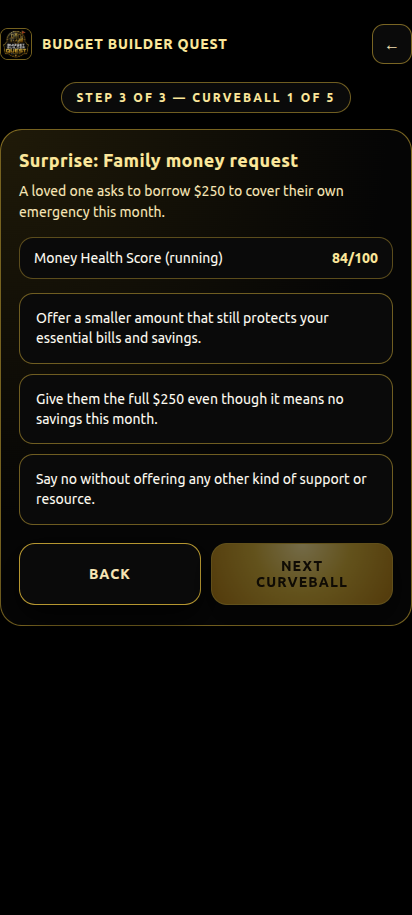
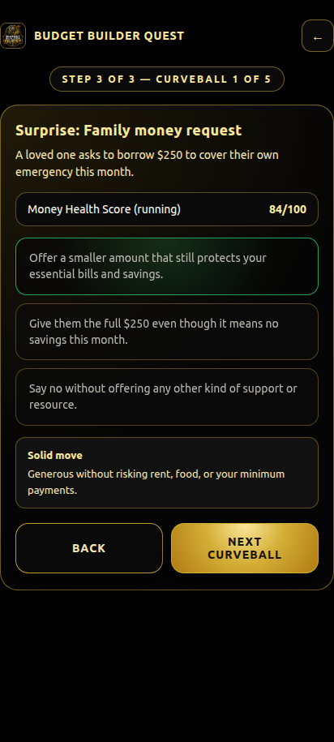
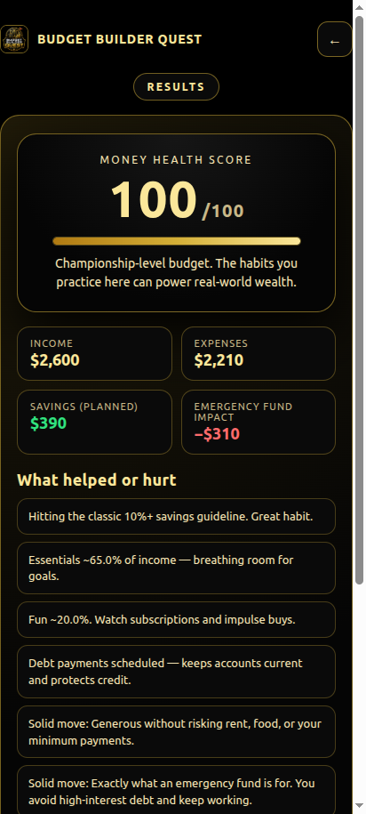
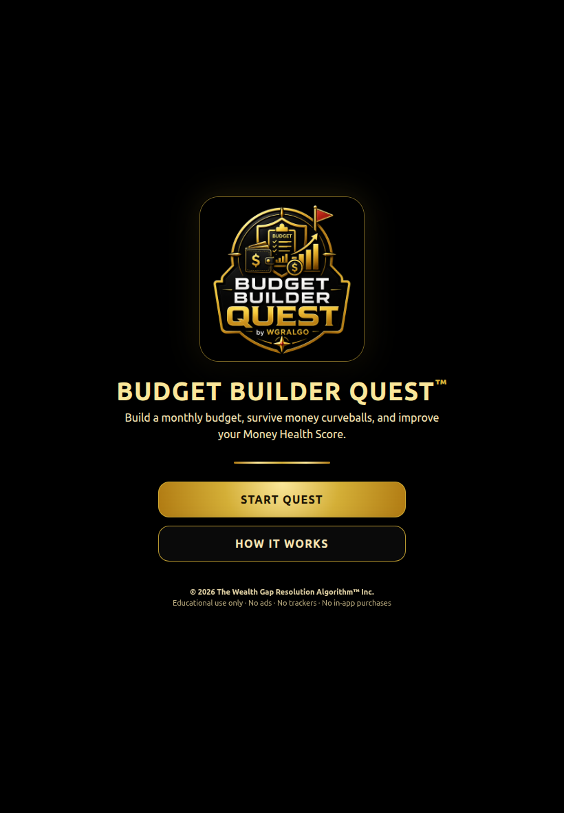

# WGRALGO Budget Builder Quest

A free, open-source, offline-first Android educational app from
**WGRALGO / The Wealth Gap Resolution Algorithm™ Inc.**

Budget Builder Quest helps users practice building a monthly budget, responding
to real-life financial curveballs, and understanding how each choice affects
their **Money Health Score**.

- No accounts.
- No ads.
- No analytics or trackers.
- No in-app purchases.
- No internet permission — runs fully offline.

---

## Features

- **Three-step quest.** Pick a profile, build a monthly budget, then respond
  to five randomized money curveballs.
- **Money Health Score (0–100).** Updates after each choice. Final score
  reflects budget structure plus event responses.
- **Three sample profiles.** Student Starter, Early Career, Family Builder.
  Income is adjustable.
- **Six budget categories.** Housing & utilities, food & household,
  transportation, debt payments, savings & investing, fun & lifestyle.
- **Realistic curveballs.** Car repair, medical bill, family money request,
  rent increase, surprise bonus — each with three responses and an
  explanation.
- **Results screen.** Money Health Score, Income, Expenses, planned Savings,
  Emergency-fund impact, and a list of what helped or hurt.
- **Touch-first UI.** Large buttons, card layout, gold-on-black theme. Works
  on phones and tablets in portrait orientation.

---

## Screenshots

Captured at a 412×915 phone viewport from the same HTML/CSS/JS that ships
inside the Android WebView. Stored in [`screenshots/`](./screenshots/).

| Landing | How It Works | Pick a profile |
| :---: | :---: | :---: |
|  |  |  |

| Build a budget | Money curveball | Feedback after a choice |
| :---: | :---: | :---: |
|  |  |  |

| Results — Money Health Score | Tablet landing | Launcher icon (no white square) |
| :---: | :---: | :---: |
|  |  |  |

Full-page scroll of the results screen, including the *What helped or hurt*
notes list, lives at
[`screenshots/07b-results-full.png`](./screenshots/07b-results-full.png).
The splash screen as rendered by Android lives at
[`screenshots/10-splash.png`](./screenshots/10-splash.png).

---

## Install (sideload the APK)

1. Download `WGRALGO_Budget_Builder_Quest_v1.0.1.apk` from the
   [Releases](https://github.com/WGRALGO/WGRALGO-Budget-Builder-Quest/releases)
   page.
2. On your Android device, allow install from unknown sources for your file
   manager or browser.
3. Open the APK file and install.
4. (Optional) Verify the download with the published SHA-256 hash:

   ```bash
   sha256sum -c WGRALGO_Budget_Builder_Quest_v1.0.1.apk.sha256
   ```

Minimum Android version: as configured by the project's Capacitor toolchain.

---

## Build from source

Requires Node.js 20+, JDK 17, and the Android SDK.

```bash
npm install
npx cap sync android
cd android
./gradlew assembleDebug      # debug APK
./gradlew assembleRelease    # signed release APK (needs keystore.properties)
```

Debug APK output:
`android/app/build/outputs/apk/debug/app-debug.apk`

Release APK output (signed):
`android/app/build/outputs/apk/release/app-release.apk`

### Release signing

Place a `keystore.properties` file at `android/keystore.properties` (this path
is gitignored). Contents:

```properties
storeFile=/absolute/path/to/your-release-keystore.jks
storePassword=...
keyAlias=...
keyPassword=...
```

When this file is present, the `release` build type is signed with that
keystore. When absent, gradle still builds an unsigned release APK.

### Regenerating icon and splash

Source assets live at `assets/icon.png` (1024×1024) and `assets/splash.png`
(2732×2732). After changing them, regenerate Android resources with:

```bash
npx capacitor-assets generate --android \
  --iconBackgroundColor "#000000" \
  --iconBackgroundColorDark "#000000" \
  --splashBackgroundColor "#000000" \
  --splashBackgroundColorDark "#000000"
```

The launcher background is forced to `#000000` in
`android/app/src/main/res/values/ic_launcher_background.xml` so the adaptive
icon shows the logo on black — no white square.

---

## Continuous integration

Every push to `main` triggers
[`.github/workflows/android.yml`](./.github/workflows/android.yml), which
builds a **debug** APK on `ubuntu-latest` and uploads it as the
`budget-builder-quest-debug` artifact.

Signed **release** APKs are built locally with the WGRALGO release keystore
and uploaded to GitHub Releases manually.

---

## Privacy

See [PRIVACY.md](./PRIVACY.md). Short version:

- No data is collected, no data is sent anywhere.
- The app does not request the `INTERNET` permission.
- Numbers you type into a Budget Builder Quest round are simulation inputs
  only. They stay on your device and are discarded when the app closes.

---

## License

This project is released under the
[GNU General Public License v3.0](./LICENSE).

You are free to use, study, modify, and redistribute it under the terms of
the GPLv3.

---

## Contributors

See [CONTRIBUTORS.md](./CONTRIBUTORS.md).

- WGRALGO / The Wealth Gap Resolution Algorithm™ Inc. — owner, concept,
  testing, publishing direction.
- ChatGPT — concept support and development guidance.
- Claude Code — Android APK implementation, source cleanup, and GitHub-ready
  packaging.

---

## Disclaimer

Budget Builder Quest is an **educational simulation**. It is not financial
advice and should not be used to make individual financial, tax, legal, or
investment decisions. Always consult a qualified professional for advice
specific to your situation. WGRALGO / The Wealth Gap Resolution Algorithm™
Inc. and the contributors make no warranty, express or implied, regarding the
accuracy or completeness of any information presented by the app.
