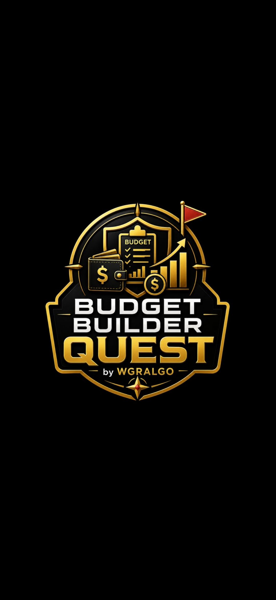
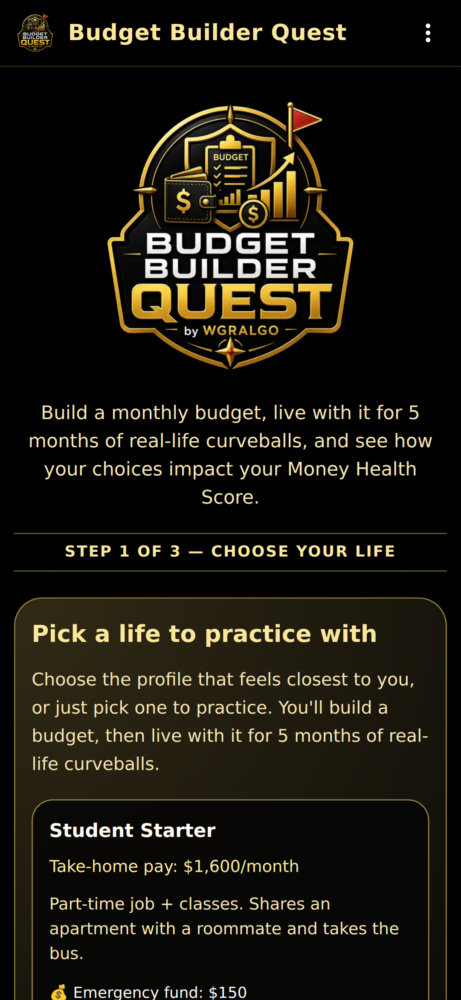
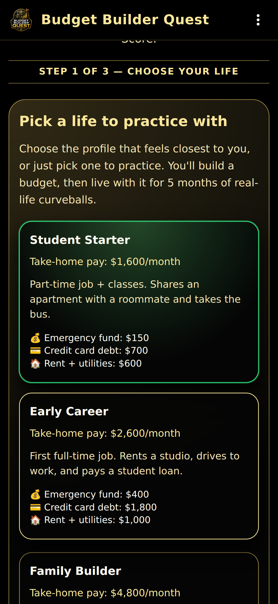
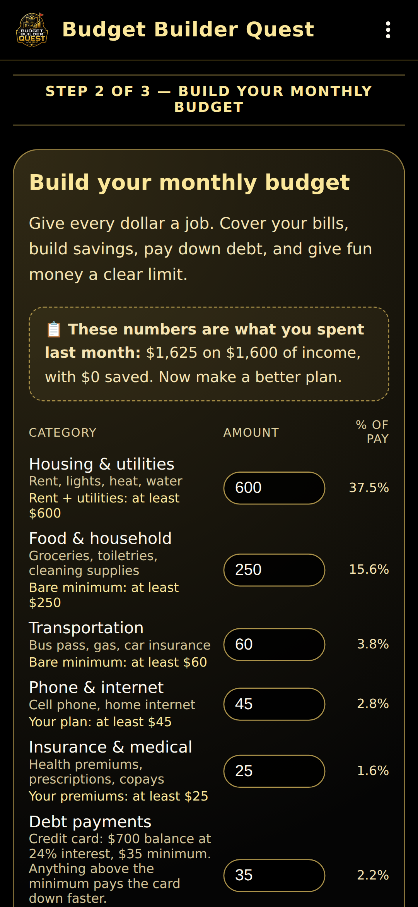
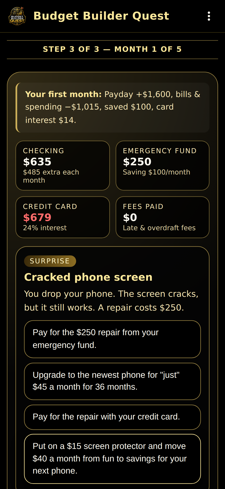
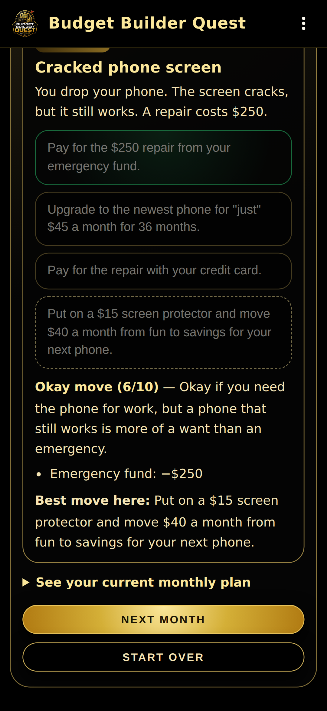
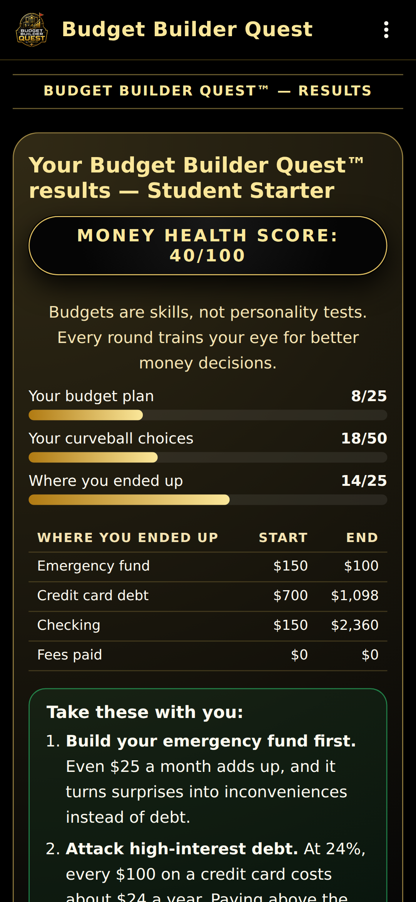
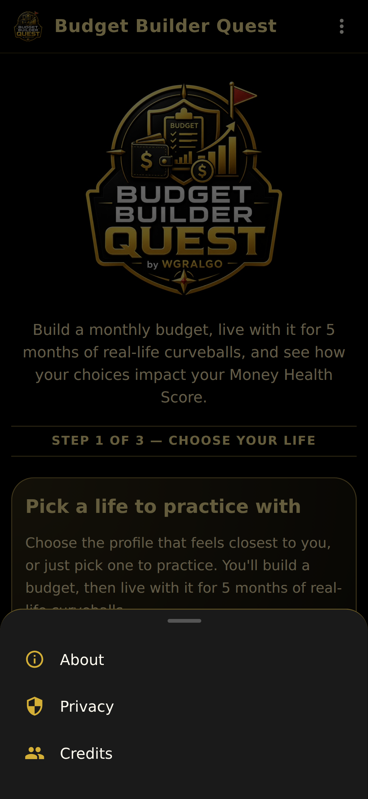
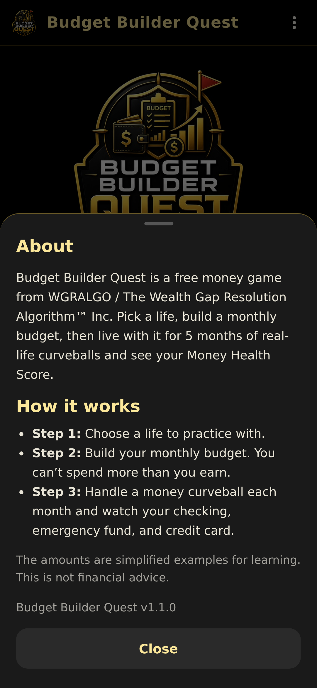

# WGRALGO Budget Builder Quest

A free, open-source, offline-first Android educational app from
**WGRALGO / The Wealth Gap Resolution Algorithm™ Inc.**

Budget Builder Quest lets you pick a life, build a monthly budget, and then
live with it for **5 months of real-life curveballs**. Every choice changes
your checking account, emergency fund, and credit card, and the game ends with
a **Money Health Score**.

- **Version:** 1.1.0
- **Package:** `com.wgra.budgetbuilder2`
- No accounts.
- No ads.
- No analytics or trackers.
- No in-app purchases.
- No internet permission. Runs fully offline.

---

## Features

- **Three steps.** Choose a life, build your monthly budget, then handle one
  money curveball each month for 5 months.
- **Three lives to practice with.** Student Starter, Early Career, and Family
  Builder, each with real bills, minimums, debts, and last month's spending.
  Income is adjustable.
- **A real budget.** Housing, food, transportation, phone, insurance,
  childcare (Family Builder), debt payments, savings, fun, and giving. Every
  bill has a realistic minimum, and you can't plan to spend more than you earn.
- **29 curveballs.** Surprises, opportunities, and temptations, each with
  several choices and an explanation. Some choices pay off or cost you in later
  months.
- **Real consequences.** Checking, emergency fund, 24% credit card interest,
  overdraft and late fees, and a 401(k) all update month by month.
- **Results.** A Money Health Score out of 100 for your budget plan, your
  choices, and where you ended up, plus tips to take with you.
- **Looks like a real app.** Black launch screen with the big logo, a new
  launcher icon, a solid app bar, About / Privacy / Credits panels, and
  Android back-button support (back steps out of the budget, asks before
  leaving a quest, and asks before exiting the app).

---

## Screenshots

Captured at a 393×852 phone viewport from the same HTML/CSS/JS that ships
inside the Android WebView. Stored in [`screenshots/`](./screenshots/).

| Launch | Home | Pick a life |
| :---: | :---: | :---: |
|  |  |  |

| Build a budget | Money curveball | Feedback |
| :---: | :---: | :---: |
|  |  |  |

| Results | Menu | About |
| :---: | :---: | :---: |
|  |  |  |

---

## Install (sideload the APK)

1. Download `WGRALGO_Budget_Builder_Quest_v1.1.0.apk` from the
   [Releases](https://github.com/WGRALGO/WGRALGO-Budget-Builder-Quest/releases)
   page.
2. On your Android device, allow install from unknown sources for your file
   manager or browser.
3. Open the APK file and install.
4. (Optional) Verify the download with the published SHA-256 hash:

   ```bash
   sha256sum -c WGRALGO_Budget_Builder_Quest_v1.1.0.apk.sha256
   ```

> **Upgrading from v1.0.0 or v1.0.1?** Version 1.1.0 is signed with a new key,
> so it can't install over the old app. Uninstall the old version first, then
> install v1.1.0. The app saves nothing on your device, so nothing is lost.

### Signing certificate (v1.1.0 and later)

- `CN=WGRALGO, OU=Budget Builder Quest, O=The Wealth Gap Resolution Algorithm Inc, C=US`
- SHA-256: `05:09:30:71:1A:43:6D:D4:8A:DE:4D:B9:E3:D3:DB:8A:65:E5:DC:18:62:18:78:E5:B7:4E:7A:AE:06:E3:DA:77`

```bash
apksigner verify --print-certs WGRALGO_Budget_Builder_Quest_v1.1.0.apk
```

---

## Build from source

Requires Node.js 20+, JDK 17, and the Android SDK.

```bash
npm install
npx cap sync android
cd android
./gradlew assembleDebug      # debug APK
./gradlew assembleRelease    # signed release APK (needs keystore.properties)
```

Debug APK output:
`android/app/build/outputs/apk/debug/app-debug.apk`

Release APK output (signed):
`android/app/build/outputs/apk/release/app-release.apk`

### Release signing

Place a `keystore.properties` file at `android/keystore.properties` (this path
is gitignored). Contents:

```properties
storeFile=/absolute/path/to/your-release-keystore.jks
storePassword=...
keyAlias=...
keyPassword=...
```

When this file is present, the `release` build type is signed with that
keystore. The env vars `BBQ_KEYSTORE_FILE`, `BBQ_KEYSTORE_PASSWORD`,
`BBQ_KEY_ALIAS`, and `BBQ_KEY_PASSWORD` work too. Without either, gradle
still builds an unsigned release APK.

Check a build before publishing:

```bash
bash tools/validate-release.sh android/app/build/outputs/apk/release/app-release.apk
```

### Icon and splash

The launcher icon, the Android 12+ system splash (`drawable-nodpi/splash_icon.jpg`),
and the legacy `splash.png` files all show the big logo on solid black, sized
to stay inside round, squircle, and square icon masks. The in-app logo is
`www/logo.jpg`.

---

## Continuous integration and releases

- [`.github/workflows/android.yml`](./.github/workflows/android.yml) builds a
  **debug** APK on every push and pull request and uploads it as the
  `budget-builder-quest-debug` artifact.
- [`.github/workflows/release.yml`](./.github/workflows/release.yml) builds,
  validates, signs, and publishes `WGRALGO_Budget_Builder_Quest_v<version>.apk`
  with its `.sha256` to GitHub Releases. Run it from the **Actions** tab or
  push a `v*` tag. It needs these repository secrets: `BBQ_KEYSTORE_BASE64`,
  `BBQ_KEYSTORE_PASSWORD`, `BBQ_KEY_ALIAS`, `BBQ_KEY_PASSWORD`.

---

## Privacy

See [PRIVACY.md](./PRIVACY.md). Short version:

- No data is collected, no data is sent anywhere.
- The app does not request the `INTERNET` permission.
- Numbers you type into a Budget Builder Quest round are simulation inputs
  only. They stay on your device and are discarded when the app closes.

---

## License

This project is released under the
[GNU General Public License v3.0](./LICENSE).

You are free to use, study, modify, and redistribute it under the terms of
the GPLv3.

---

## Contributors

See [CONTRIBUTORS.md](./CONTRIBUTORS.md).

- WGRALGO / The Wealth Gap Resolution Algorithm™ Inc. — owner, concept,
  testing, publishing direction.
- ChatGPT — concept support and development guidance.
- Claude Code — Android APK implementation, source cleanup, and GitHub-ready
  packaging.

---

## Disclaimer

Budget Builder Quest is an **educational simulation**. It is not financial
advice and should not be used to make individual financial, tax, legal, or
investment decisions. Always consult a qualified professional for advice
specific to your situation. WGRALGO / The Wealth Gap Resolution Algorithm™
Inc. and the contributors make no warranty, express or implied, regarding the
accuracy or completeness of any information presented by the app.
